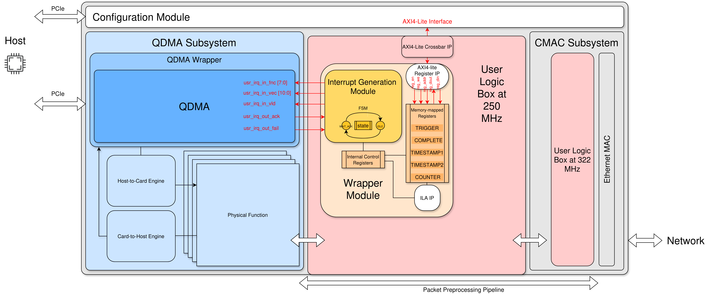
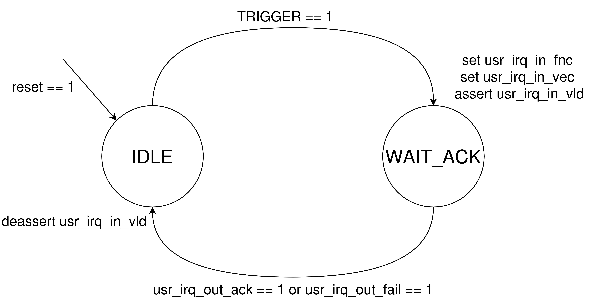
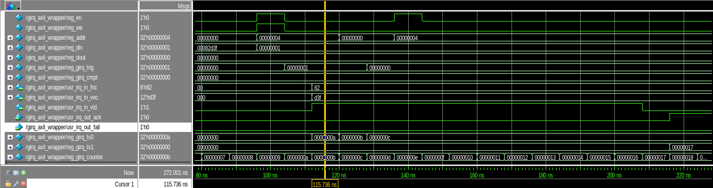

# OpenNIC Shell Interrupt Generation Module

This repository is a fork of the [Xilinx OpenNIC Shell repository](https://github.com/Xilinx/open-nic-shell), licensed under the Apache License Version 2.0.
This fork implements an ** interrupt generation** module. The goal is to generate user-defined interrupts using the QDMA subsystem. This is a part of a project that investigates methods to enhance server-side interrupt handling. For interrupt Hanlding in the Kernel, see our [fork of the Xilinx QDMA Driver](https://github.com/MonderMonderMonder/dma_ip_drivers_with_irq_handling).

## Features

- **Custom Interrupt Generation**: Implements a Verilog-based hardware module for generating PCIe MSI-X interrupts in conjunction with the Xilinx QDMA subsystem.
- **AXI4-Lite Control Interface**: An AXI4-Lite interface that provides configuration and status registers for the interrupt module.
- **Timestamping and Latency Measurement**: A high-precision timestamping mechanism using a 4 ns resolution counter is integrated for measuring interrupt handling latency.
- **CPU Core Affinity**: Support for IRQ Affinity, targeting specific CPU cores to enhance cache locality and optimize interrupt handling in multi-core systems.
- **Flexible FSM Design**: Manages the interrupt generation process through a finite state machine that handles QDMA interactions for both interrupt acknowledgments and failures.

## Repository Structure

This repository maintains the directory structure of the original **Xilinx OpenNIC Shell** while extending the `plugin/user_interrupt` directory to include the custom interrupt generation module. Key components include:

- `box_250mhz/user_ip/girq/hdl/gen_irq.v`: The core Verilog module for interrupt generation.
- `box_250mhz/user_ip/girq/hdl/girq_axil_wrapper.v`: A Verilog wrapper implementing the AXI4-Lite interface for memory-mapped I/O.
- `box_250mhz/user_ip/girq/test/girq_axil_wrapper_test.py`: A Python-based testbench using Cocotb to simulate and verify the interrupt generation module.
- `box_250mhz/user_ip/girq/test/start_sim.sh`: Shell script for starting the simulation in QuestaSim.
- `box_250mhz/user_ip/girq/test/Makefile`: Automates the build and simulation processes.

### Integration in OpenNIC Shell

The custom interrupt generation module is integrated into the **250 MHz user logic box** in the OpenNIC shell. It interfaces with the **QDMA subsystem** for generating MSI-X interrupts and the **AXI4-Lite interface** for configuration and control. The QDMA subsystem manages the DMA transfers and interrupts sent to the host, while the **interrupt generation module** handles the logic required for sending MSI-X interrupts with precise control and feedback.

### Finite State Machine

The FSM controls the interrupt generation process. It includes two main states:
1. **IDLE**: Waiting for the host to trigger an interrupt.
2. **WAIT_ACK**: Waiting for an acknowledgment or failure response from the QDMA subsystem before returning to IDLE.

### Latency Measurement

The latency measurement mechanism uses a free-running counter with a resolution of 4 ns. It records timestamps before and after the interrupt is generated and acknowledged. These timestamps can be read by the host system to calculate the total latency for processing the interrupt. The timestamps are stored in memory-mapped registers accessible via the AXI4-Lite interface.

### Testing and Verification

A Cocotb-based testbench (`girq_axil_wrapper_test.py`) is provided to simulate the interaction between the interrupt generation module and the QDMA subsystem. The testbench verifies the following functionalities:
- **Register access** via the AXI4-Lite interface.
- **Interrupt generation and acknowledgment**.
- **Correct handling of QDMA feedback** (acknowledgment or failure).

The simulation results can be visualized using a waveform viewer.

## Xilinx OpenNIC Shell

For more details on the OpenNIC Shell architecture, please refer to the original README of the [Xilinx OpenNIC Shell repository](https://github.com/Xilinx/open-nic-shell).

---

This repository contains files and materials originally provided by Xilinx, Inc.. We retain the copyright notice and disclaimer from the original [Xilinx OpenNIC Shell repository](https://github.com/Xilinx/open-nic-shell), licensed under the Apache License Version 2.0:

# Copyright Notice and Disclaimer

This file contains confidential and proprietary information of Xilinx, Inc. and
is protected under U.S. and international copyright and other intellectual
property laws.

DISCLAIMER

This disclaimer is not a license and does not grant any rights to the materials
distributed herewith.  Except as otherwise provided in a valid license issued to
you by Xilinx, and to the maximum extent permitted by applicable law: (1) THESE
MATERIALS ARE MADE AVAILABLE "AS IS" AND WITH ALL FAULTS, AND XILINX HEREBY
DISCLAIMS ALL WARRANTIES AND CONDITIONS, EXPRESS, IMPLIED, OR STATUTORY,
INCLUDING BUT NOT LIMITED TO WARRANTIES OF MERCHANTABILITY, NONINFRINGEMENT, OR
FITNESS FOR ANY PARTICULAR PURPOSE; and (2) Xilinx shall not be liable (whether
in contract or tort, including negligence, or under any other theory of
liability) for any loss or damage of any kind or nature related to, arising
under or in connection with these materials, including for any direct, or any
indirect, special, incidental, or consequential loss or damage (including loss
of data, profits, goodwill, or any type of loss or damage suffered as a result
of any action brought by a third party) even if such damage or loss was
reasonably foreseeable or Xilinx had been advised of the possibility of the
same.

CRITICAL APPLICATIONS

Xilinx products are not designed or intended to be fail-safe, or for use in any
application requiring failsafe performance, such as life-support or safety
devices or systems, Class III medical devices, nuclear facilities, applications
related to the deployment of airbags, or any other applications that could lead
to death, personal injury, or severe property or environmental damage
(individually and collectively, "Critical Applications"). Customer assumes the
sole risk and liability of any use of Xilinx products in Critical Applications,
subject only to applicable laws and regulations governing limitations on product
liability.

THIS COPYRIGHT NOTICE AND DISCLAIMER MUST BE RETAINED AS PART OF THIS FILE AT
ALL TIMES.
